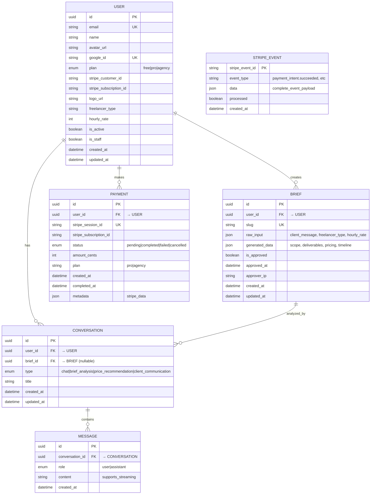

## Database Schema Overview

### Key Stats
- **6 Tables** total
- **3 Foreign Keys** for relationships
- **4 UUID Primary Keys** (better security)
- **Multiple Enums** for type safety
- **JSON Fields** for flexible storage

### Primary Relationships
- 1 User → Many Briefs
- 1 User → Many Payments  
- 1 User → Many Conversations
- 1 Brief → Many Conversations
- 1 Conversation → Many Messages

### Core Features
✅ Plan-based access control (Free/Pro/Agency)  
✅ Stripe payment integration with webhooks  
✅ AI conversation history with multiple modes  
✅ Brief generation and client approval  
✅ Audit trail (created_at, updated_at)  
✅ IPv6 support for approver tracking  

### Query Examples

**Get user's briefs:**
```sql
SELECT * FROM briefs WHERE user_id = {user_id} ORDER BY created_at DESC
```

**Get conversation with all messages:**
```sql
SELECT m.* FROM messages m 
WHERE m.conversation_id = {conversation_id} 
ORDER BY m.created_at ASC
```

**Get completed payments (revenue):**
```sql
SELECT SUM(amount_cents)/100 as revenue 
FROM payments 
WHERE status = 'completed' AND created_at >= NOW() - INTERVAL '30 days'
```

**Get brief statistics:**
```sql
SELECT 
  COUNT(*) as total_briefs,
  COUNT(CASE WHEN is_approved THEN 1 END) as approved,
  COUNT(CASE WHEN is_approved = false THEN 1 END) as pending
FROM briefs
WHERE user_id = {user_id}
```
